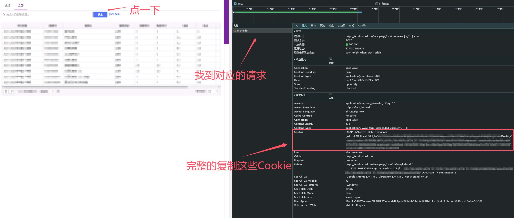

# tools4szu
Convenient tools for szu

szu常用小工具~
---
请点进二级目录查看详情~

- [szu-dorm-helper](szu-dorm-helper)  
  深大宿舍电费提醒小助手
- [xxt_autosign](xxt_autosign)  
  学习通自动签到小工具
- [gra-autocourse](gra-autocourse)  
  研究生自动选课小工具
- [gra-prescore](gra-prescore)  
  研究生查成绩小工具
- [detailed-score](detailed-score)  
  本科查询详细成绩小工具 (可分别查平时成绩和期末成绩)
- [keepdrcom](keepdrcom)  
  宿舍区&教学区自动联网小工具

如有任何疑问，请提PR或Issue，thx，或邮件联系`szudyh@qq.com`
如果使用有帮助，麻烦点个Star~

**本项目仅供学习交流使用，使用本工具造成的一切后果均由脚本使用者负责，开发者不承担任何责任。**

---
**Q&A：**
- Q: 怎么获得Cookie？
- A: 登录到对应的网站，打开开发者工具，找到Network，找到对应的请求，复制Cookie即可。 以detailed-score为例：

然后把`Cookie`的值复制到脚本中对应位置即可。
